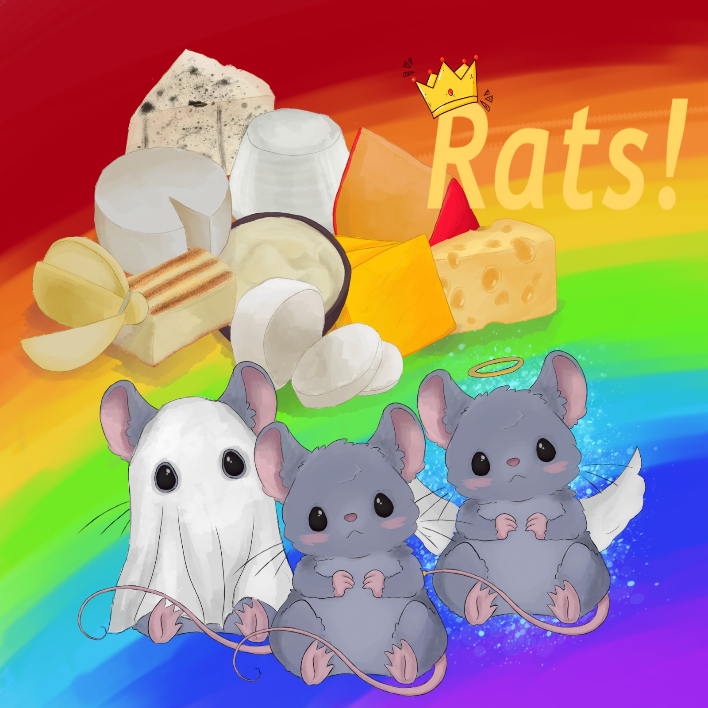
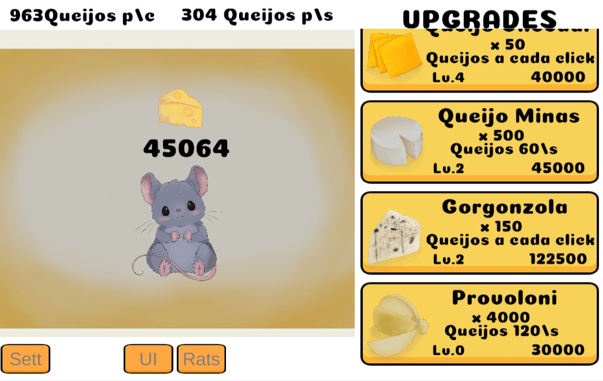
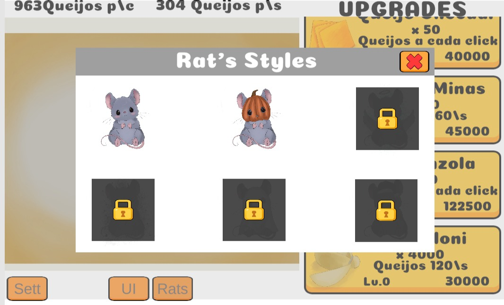
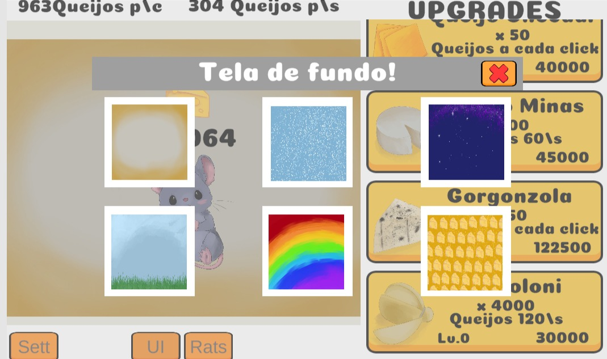

# 🐭 Clicker Rats! 🧀

**Clicker Rats!** é um jogo **idle/clicker** desenvolvido em **Unity**, no qual você assume o papel de um rato obcecado por queijo! Clique, evolua e conquiste toneladas de queijos enquanto desbloqueia upgrades automáticos e vê os números crescerem infinitamente.

---

## 🎮 Gameplay

- **Clique para obter queijos.**
- **Compre upgrades** que aumentam a produção automática a cada "x" segundos.
- Os números crescem em **escala exponencial**, com suporte para quantidades absurdas graças ao uso de **BigInteger**
- Visual divertido e responsivo para **jogos mobile**

---

## 🧠 Mecânicas principais

- 🖱️ Sistema de **click** manual
- ⏱️ **Geração automática** de queijos por segundos
- 💹 **Sistema de upgrades** com custos e retornos crescentes
- 🔢 Números formatados com sufixos (`K`, `M`, `B`, etc.), usando função personalizada
- 📈 Os textos se expandem automaticamente para acomodar valores grandes, sem quebrar o layout

---

## 📱 Suporte Mobile

- Interface totalmente adaptada para **celulares**
- Otimização para diferentes **resoluções e proporções de tela**
- Pronto para exportar para lojas mobile

---

## 🛠️ Tecnologias Utilizadas

- **Unity Engine**
- **C#**
- **BigInteger** (System.Numerics)
- **Unity UI Toolkit / Canvas**
- **Unity Version Control (Plastic SCM)**

---

## 📸 Capturas de tela

> 
> 
> 

---

## 🚀 Status do Projeto

> ✅ Em desenvolvimento  
> 🎯 Próximo passo: balanceamento de upgrades e exportação para iOS
> 🚀 Próximo passo: Lançar o jogo em plataformas

---

## 📂 Como rodar o projeto

1. Itch.io:
https://nomty.itch.io/rats

2. Baixar o arquivo APK para celular:
https://nomty.itch.io/rats (acessar os arquivos para download do jogo) 
